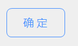
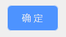
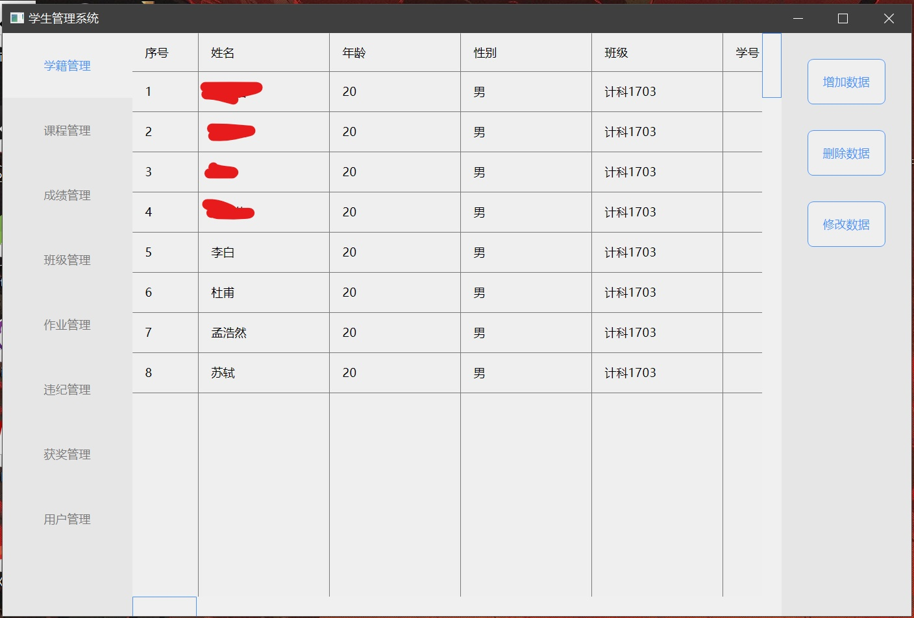
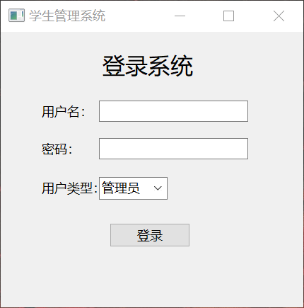
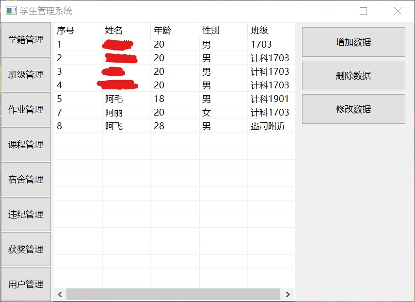

## 前言
本学期的 **数据库课程设计** 没有意外的，被常驻校内的培训机构承包了，说实话，在开始之前我非常期待，因为每次他们的课程都会给我带来不一样的“惊喜”——这次也不例外：要求使用 **SWT** 写 GUI，数据库部分倒是中规中矩使用 **MySQL**，不过给的版本是 **5.0**，现在都 2019 年了呀我的天啊，但我还能说啥呢，做吧。

## 初探 SWT
在这之前我没有了解过 **SWT**，虽然我也写 JAVA，但只限于 Android，这之外的我统统不了解（叉腰.jpg），所以先大概看一下它是个什么神仙框架。

先百度一下：
> SWT(Standard Widget Toolkit) Standard Widget Toolkit 是一个开源的 GUI 编程框架，与 AWT/Swing 有相似的用处，著名的开源 IDE-eclipse 就是用SWT开发的。 在 SWT 之前，Sun 已经提供了一个跨平台 GUI 开发工具包 AWT (Abstract Windowing Toolkit)。AWT 框架底层使用原生窗口部件(native widgets)构建，只能使用各个平台窗口部件的子集。

_哦！原来 Eclipse 是用它写的界面啊_ 

看了介绍，看使用方法：

#### 1.创建窗口 
```java
import org.eclipse.swt.widget.*;
 :
Display display = new Display();
Shell shell = new Shell(display);
shell.setText("Shell Title");
// *** 在这里构造 shell ***
shell.open();       // 打开 shell 
// 处理用户输入事件(鼠标、键盘)
while(!shell.isDisposed()) {
   // 处理或等待事件直到 disolay 不可用(dispatch)为止
   if(!display.readAndDispatch()) {
       display.sleep();
   }
}
display.dispose();  // 一定要记得清除 display
``` 
**Shell** 可以理解为窗口，**Display** 可以抽象的理解为程序的主体，**主要负责界面的还是 Shell**，Display 的工作是掌控大局，无需详细关心，**shell.open()** 的效果就是通过 JNI 调用系统的 api 创建一个窗口。

#### 2.添加一个控件
```java
import org.eclipse.swt.widget.*;
 :
Composite parent = ...;
 :
// 创建一个文本控件
Label name = new Label(parent, SWT.NONE);  
name.setText("hello!");
```
**Label** 的构造函数中的 **parent** 参数是 **Composite** 类型，查看 [帮助手册](https://help.eclipse.org/luna/index.jsp?topic=%2Forg.eclipse.platform.doc.isv%2Freference%2Fapi%2Forg%2Feclipse%2Fswt%2Fwidgets%2FShell.html&is-external=true) 可以发现 **Shell** 也继承自 Composite，所以我们可以直接用 shell 构造控件，后面我会用 Composite 扩展出一套自己的组件，不喜欢花里胡哨的组件可以不看后面的部分。

#### 3.为控件添加事件监听
```java
 import org.eclipse.swt.widget.*;
 :
Composite parent = ...;
 :
// 创建一个按钮控件
Button button = new Button(parent, SWT.PUSH);  
button.setText("Button");
// 监听按钮的选择事件
button.addSelectionListener(new SelectionListener() { 
    public void widgetelected(selectionEvent e) {
        System.out.println("Click!");   
    }
    public void widgetDefaultSelected(selectionEvent e) {
        widgetelected(e);
    }
});
```
这里用按钮控件示范了一下，这是一个标准的监听者模式，监听发生的事件并调用相应的函数。

#### 4.布局 

在 SWT 中，布局主要有以下几种：
- **AbsoluteLayout**
_绝对布局，默认的布局方式，通过子控件的具体坐标进行的绝对位置布局，如果子控件没有设置具体坐标则放置到父控件的(0, 0)位置。_
- **FillLayout**
_竖直或水平方向填充父控件大小，布局中的子控件大小平均分配。_
- **RowLayout**
_所有子控件水平或竖直排布，一行或一列放不下自动排到下一行或下一列，通过设定 RowData 指定具体子控件的大小。_
- **GridLayout**
_顾名思义，网格布局，通过 GridData 设置布局参数。_
- **StackLayout**
_层叠布局，只显示最顶层的子控件，通过 topControl 属性设置顶层的子控件。_

具体可以参照 [Understanding Layouts in SWT](https://www.eclipse.org/articles/Article-Understanding-Layouts/Understanding-Layouts.htm)。

#### 5.我好了
看完以上几个知识点，我觉得差不多可以开始了，觉得还需要补充的同学可以看看下面两个链接：
- [SWT 和 JFace](https://www.ibm.com/developerworks/cn/opensource/os-jface1/index.html)
- [SWT 界面设计详解](http://images.china-pub.com/ebook3020001-3025000/3020847/ch03.pdf)

## 开始花里胡哨
当按照前面的知识点写了几行代码并运行后，我开始觉得无聊，你看那丑丑的按钮，你看那毫无生趣的输入框，全都是 windows 自带的组件，SWT 的工作便是调用原生系统的组件，按照程序员的意愿布局、展现，方便确实是方便，但真的不好看啊！

**为什么不自己写组件？**

在 Android 开发中，可以继承自 View 创建自定义组件，用 Android 提供的 Canvas(画布) 绘制自定义组件。那么 SWT 呢？它有绘制图像的方法吗？

**查了查，有的**

Composite 可以监听绘制事件，绘制事件包含了一个 **GC(Graphics)** 类的参数 **gc**，而 GC 类就是专门用来画图的，它包含了 drawText()、drawLine() 等等基础的绘图函数。 

没想到的是它还有一个 **setAdvance()** 方法，可以开启高级绘图模式，高级模式下可以调用抗锯齿、矩阵变换等等方法......矩阵我应该用不到，但抗锯齿还是挺有用的。

Composite 类初始化时，可以通过使用 **SWT.DOUBLE_BUFFERED** 标志开启双缓冲绘图模式，龟龟，直接让我少写一堆代码。 

而且在我查文档的时候，发现了这样一篇文章： 
- [Creating Your Own Widgets using SWT](https://www.eclipse.org/articles/Article-Writing%20Your%20Own%20Widget/Writing%20Your%20Own%20Widget.htm) 

这是一篇来自 2001 年的官方教程，这下好了，少走很多弯路，接下来开始编写自定义组件！

### 1.从自定义 Widget 基类开始 
因为 Flutter 写多了，所以就用 Widget 这个名字吧！ 

按照上面的自定义组件官方教程所叙述，我们的自定义组件可以选择继承 **Canvas** 或者 **Composite**，我建议使用 Composite，因为 Canvas 是继承自 Composite 的，所以继承自 Composite 写自定义组件可以更为灵活。 

还有一个关键的原因是，如果继承自 Canvas，在某些情况下 **可能无法监听到绘制事件**，它需要一个 Composite 来包裹并且 Composite 要有一个确定的大小，也就是说只有包裹它的 Composite 绘制了，它才能接收到绘制事件。 

我们的 Widget 完整代码如下：
```java
package app.custom;

import org.eclipse.swt.SWT;
import org.eclipse.swt.events.*;
import org.eclipse.swt.graphics.*;
import org.eclipse.swt.widgets.*;

public class Widget extends Composite {

    // 枚举类型，拖拽方向
    public enum DragDirection {
        VERTICAL, HORIZONTAL
    }

    // WidgetManager，统一管理 Widget，负责事件分发
    WidgetManager manager;

    // 默认宽度
    protected int width = 100;

    // 默认高度
    protected int height = 100;

    // 鼠标是否经过
    protected Boolean isMouseHover = false;

    // 鼠标是否按下
    protected Boolean isMouseDown = false;

    // 是否为焦点
    protected Boolean isFocus = false;

    // 上次鼠标的坐标
    protected Point lastPos = new Point(-1, -1);

    // 在 WidgetManager 中的唯一序列号
    protected int index = -1;

    public Widget(Composite parent, WidgetManager manager) {
        // 默认开启双缓冲
        super(parent, SWT.DOUBLE_BUFFERED);
        this.manager = manager;
        // 将此 Widget 添加进 WidgetManager，addChild() 函数会返回一个唯一序列号
        index = manager.addChild(this);
        setSize(computeSize(SWT.DEFAULT, SWT.DEFAULT, false));
        // 监听事件，这里将事件转为一个个函数，这样子组件继承后直接 Override 即可
        addDisposeListener(e -> onDispose(e));
        addListener(SWT.Paint, e -> onPaint(e.gc));
        addListener(SWT.MouseEnter, e -> onMouseEnter());
        addListener(SWT.MouseExit, e -> onMouseExit());
        addListener(SWT.FOCUSED, e -> onFocus());
        addListener(SWT.KeyDown, e -> onKeyDown(e));
        addListener(SWT.MouseMove, e -> onMouseMove(e));
        addListener(SWT.MouseDown, e -> onMouseDown());
        addListener(SWT.MouseUp, e -> onMouseUp());
    }
    
    @Override
    public Point computeSize(int wHint, int hHint, boolean changed) {
        if (wHint != SWT.DEFAULT) width = wHint;
        if (hHint != SWT.DEFAULT) height = hHint;
        return new Point(width, height);
    }

    @Override
    public void setSize(int width, int height) {
        super.setSize(width, height);
        this.width = width;
        this.height = height;
    }

    // 调用可设置鼠标指针的样式
    public void setCursor(int style) {
        setCursor(new Cursor(Display.getCurrent(), style));
    }

    /**
     * 获取鼠标拖拽的方向
     * @return DragEvent
     */
    private DragEvent getDragDirection(Event e, Point pos) {
        DragDirection direction = DragDirection.VERTICAL;
        int offset = 0;
        if (lastPos.x != -1) {
            int offsetX = Math.abs(lastPos.x - pos.x);
            int offsetY = Math.abs(lastPos.y - pos.y);
            if (offsetX >= offsetY) {
                direction = DragDirection.HORIZONTAL;
                offset = lastPos.x - pos.x;
            } else {
                offset = lastPos.y - pos.y;
            }
        }
        return new DragEvent(direction, offset);
    }

    /**
     * 自定义组件的核心，在这里绘制组件
     */
    public void onPaint(GC gc) {
        // 开启高级绘图模式
        if (!gc.getAdvanced()) {
            gc.setAdvanced(true);
        }
        // 开启抗锯齿
        if (gc.getAdvanced() && gc.getAntialias() == SWT.OFF) {
            gc.setAntialias(SWT.ON);
        }
    }

    /**
     * 记得在这里销毁 Graphics 资源，防止内存溢出
     */
    public void onDispose(DisposeEvent e) {

    }

    /**
     * 鼠标进入组件时
     */
    public void onMouseEnter() {
        if (!isMouseHover)
            isMouseHover = true;
    }

    /**
     * 鼠标离开组件时
     */
    public void onMouseExit() {
        if (isMouseHover)
            isMouseHover = false;
        lastPos.x = -1;
        lastPos.y = -1;
    }

    /**
     * 鼠标按下时
     */
    public void onMouseDown() {
        if (!isMouseDown)
            isMouseDown = true;
    }

    /**
     * 鼠标抬起时
     */
    public void onMouseUp() {
        if (isMouseDown)
            isMouseDown = false;
    }
    
    /**
     * 鼠标移动时
     */
    public void onMouseMove(Event e) {
        if (isMouseHover && isMouseDown) {
            Point pos = e.display.getCursorLocation();
            onMouseDrag(getDragDirection(e, pos));
            lastPos.x = pos.x;
            lastPos.y = pos.y;
            //Log.d("onMouseMove direction: " + pos.x);
        }
    }

    /**
     * 鼠标拖拽时
     */
    public void onMouseDrag(DragEvent e) {
        //Log.d("onMouseDrag direction: " + e.getDirection());
        //Log.d("onMouseDrag offset: " + e.getOffset());
    }

    /**
     * 组件获得焦点时
     * 注意 onFocus 事件是由 WidgetManager 管理分发的
     * 因为 Composite默认无法响应 Focus 事件，我也没有再深入阅读源码，所以自己处理了
     */
    public void onFocus() {
        if (!isFocus)
            isFocus = true;
        manager.notifyIfGetFocus(index);
        // Log.d("focus");
    }

    /**
     * 组件失去焦点时
     * 也是由 WidgetManager 管理
     */
    public void onBlur() {
        if (isFocus)
            isFocus = false;
        // Log.d("blur");
    }

    /**
     * 键盘按下时
     * 因为要自己处理焦点，所以在按下 tab 键时要转移焦点，调用 WidgetManager 的 notifyChangeFocus() 以转移焦点
     */
    public void onKeyDown(Event e) {
        if (e.keyCode == 9) {
            manager.notifyChangeFocus(index);
        }
    }

}
``` 

**Widget** 基类的主要任务是 **处理事件** 和 **绘制组件**，详细的逻辑我们直接继承 Widget 再扩展就好了。

### 2.如何自己处理焦点
因为一些焦点事件我们无法接收，所以再单独写一个 **WidgetManager** 类用于管理我们的 Widget：
```java
package app.custom;

import java.util.*;

import org.eclipse.swt.SWT;
import org.eclipse.swt.widgets.Composite;

public class WidgetManager {

    // 持有的所有 widgets Map，唯一序列号作为 key
    Map<Integer, Widget> widgets = new HashMap<>();

    // 可获得焦点的 widgets 列表
    List<Widget> focusableWidgets = new ArrayList<>();

    int index = 0;

    public WidgetManager(Composite parent) {
        parent.addListener(SWT.MouseDown, e -> onMouseDown());
    }

    /**
     * 将组件添加至 widgets 列表
     */
    public int addChild(Widget widget) {
        widgets.put(index, widget);
        //Log.d("child " + index + " add");
        index++;
        return index - 1;
    }

    /**
     * 每次鼠标点击时必然会发生焦点改变
     * 所以在这里要判断一下
     */
    private void onMouseDown() {
        // 直接继承至 Composite 无法直接监听 FocusOut 事件，所以自己判断焦点事件
        for (int i : widgets.keySet()) {
            if (!widgets.get(i).isMouseHover) {
                widgets.get(i).onBlur();
            }
        }
    }

    /**
     * 当子组件获得焦点，遍历其它子组件，找到当前持有焦点的组件，将其焦点取消
     */
    public void notifyIfGetFocus(int index) {
        assert (index != -1) : "widget not add into manager";
        for (int i : widgets.keySet()) {
            if (i != index) {
                widgets.get(i).onBlur();
            }
        }
    }

    /**
     * 当子组件主动舍弃焦点时调用该函数
     */
    public void notifyChangeFocus(int index) {
        assert (index != -1) : "widget not add into manager";
        //Log.d("current focus on:" + index);
        int target = 0;
        if (!focusableWidgets.isEmpty()) {
            Boolean toNext = false;
            for (Widget widget : focusableWidgets) {
                if (toNext) {
                    target = widget.index;
                    toNext = false;
                    break;
                }
                if (widget.index == index) {
                    toNext = true;
                }
            }
            focusableWidgets.get(target).onFocus();
            focusableWidgets.get(target).setFocus();
            Log.d("change focus to:" + target);
        }
    }

    // 设置该组件可以响应 Focus 事件
    public void setFocusable(int index) {
        focusableWidgets.add(widgets.get(index));
    }

}
``` 
**WidgetManager** 的主要工作是处理焦点，或者有其他关联所有 Widget 的功能也可以在这里扩展。

### 3.自定义按钮示例 
万事具备，只欠东风，接下来我们在搭好的基础之上编写一个按钮组件：
```java
package app.custom;

import org.eclipse.swt.SWT;
import org.eclipse.swt.events.DisposeEvent;
import org.eclipse.swt.graphics.*;
import org.eclipse.swt.widgets.Composite;

import app.utils.C; // 颜色的静态类
import lombok.Setter; // lombok 懒人利器

/**
 * 自定义按钮
 * written by liuwenkiii
 */
public class MyButton extends Widget {

    @Setter
    protected String text = "Button"; // 按钮文本

    protected Point textOffset = new Point(0, 0); // 文本坐标偏移

    @Setter
    protected int radius = 0; // 圆角

    @Setter
    protected Color textColor = C.black; // 文本颜色

    @Setter
    protected Color textHoverColor = C.white; // 鼠标经过时的文本颜色

    @Setter
    protected Color backgroundColor = C.white; // 背景颜色

    @Setter
    protected Color hoverColor = C.blue; // 鼠标经过时的颜色

    @Setter
    protected Boolean drawBorder = true; // 是否绘制边框

    @Setter
    protected Boolean textFollowBorder = true; // 文本颜色是否与边框颜色一样

    public MyButton(Composite parent, WidgetManager manager) {
        super(parent, manager);
    }

    /**
     * 计算按钮文本的位置
     * 这里的文本放在了按钮正中间
     * 如果文本的大小大于按钮大小，则改变按钮大小为文本大小
     */
    public void centerText(GC gc) {
        Point textSize = gc.textExtent(text);
        if (width < textSize.x) {
            width = textSize.x;
            setSize(height, textSize.x);
        } else {
            textOffset.x = (int) (width - textSize.x) / 2;
        }
        if (height < textSize.y) {
            height = textSize.y;
            setSize(width, textSize.y);
        } else {
            textOffset.y = (int) (height - textSize.y) / 2;
        }
    }

    /**
     * 绘制按钮中心的文本
     */
    protected void drawCenterText(GC gc) {
        if (!textFollowBorder) {
            if (isMouseHover) {
                gc.setForeground(textHoverColor);
            } else {
                gc.setForeground(textColor);
            }
        }
        gc.drawText(text, textOffset.x, textOffset.y);
    }

    @Override
    public void onPaint(GC gc) {
        //Log.d("MyButton: onPaint");
        super.onPaint(gc);
        centerText(gc);
        // 当鼠标经过时，颜色互换
        if (isMouseHover) {
            gc.setForeground(backgroundColor);
            gc.setBackground(hoverColor);
        } else {
            gc.setForeground(hoverColor);
            gc.setBackground(backgroundColor);
        }
        gc.fillRoundRectangle(0, 0, width, height, radius, radius);
        if (drawBorder) {
            gc.drawRoundRectangle(0, 0, width - 1, height - 1, radius, radius);
        }
        drawCenterText(gc);
    }

    @Override
    public void onDispose(DisposeEvent e) {
        super.onDispose(e);
        //Log.d("MyButton: onDispose");
    }

    /**
     * 鼠标进入时设置指针样式为小手
     * 并调用 redraw() 重绘
     */
    @Override
    public void onMouseEnter() {
        super.onMouseEnter();
        //Log.d("MyButton: onMouseHover");
        setCursor(SWT.CURSOR_HAND);
        redraw();
    }
    /**
     * 鼠标离开时设置指针样式为默认
     * 并调用 redraw() 重绘
     */
    @Override
    public void onMouseExit() {
        super.onMouseExit();
        setCursor(SWT.CURSOR_ARROW);
        redraw();
    }
    
}
``` 

然后使用我们的按钮：
```java
...

WidgetManager manager = new WidgetManager(shell);

...

MyButton btn = new MyButton(shell, manager);
btn.setText("确 定");
btn.setSize(100, 50);
btn.setRadius(16);
// 添加点击事件的监听
btn.addListener(SWT.MouseDown, e -> login());

...
```

运行后，我们得到一个圆角按钮。 

 

鼠标移上去会变色。
 

**至此，我们可以放飞自我了，想写什么样的组件就写什么样的组件！**(叉腰.jpg)  

放一张主界面的图，以下全部都是自定义组件，包括中间那个表格：

  

源码全部放在 Github 上了，[点这里](https://github.com/liuwenkiii/Student-Management-System-SWT) 传送。

## 总结 
最后课程设计没能写完，因为只给了三天时间......答辩的时候老师毫不关心你的圆角按钮是怎么来的，没写完就是没写完......于是当天花了5小时重写了一个简单的，Eclipse还支持直接拖拽放置组件，难道这样开发不香吗？ 

重写的简单的界面：

 

 

但这三天给我的收获还是挺多的，虽然 SWT 学好了没啥用，但我现在有点想尝试写一个自己的 GUI 框架了，确实有点膨胀，我明白真正的框架要处理的问题不止于此，要学习的还有很多。共勉！
